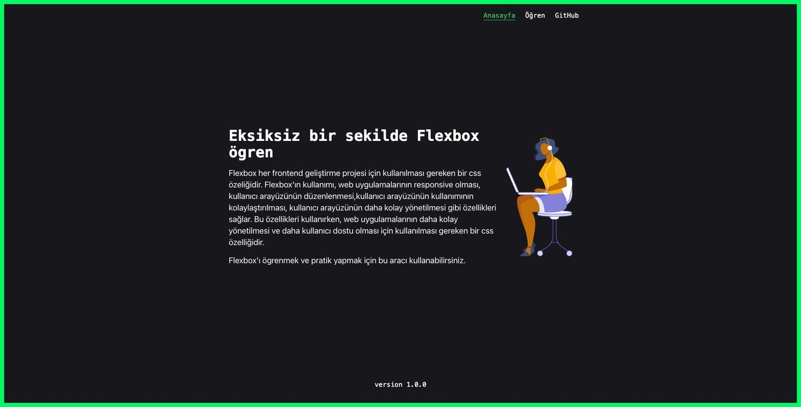
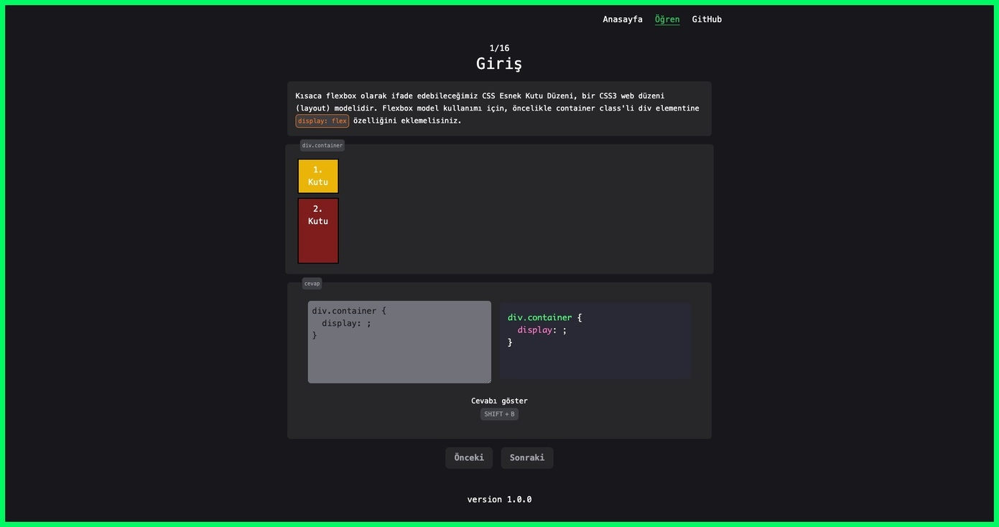

# [learn-flexbox-tr.netlify.app](https://learn-flexbox-tr.netlify.app/)

This is a project that makes learning flexbox easy.

## Features

- **Step by Step Learn**
- **Interactive**

## Packages

- Unique ID: [nanoid](https://www.npmjs.com/package/nanoid)
- Markdown: [markdown-to-jsx](https://www.npmjs.com/package/markdown-to-jsx)
- Syntax highlighting: [react-syntax-highlighter](https://www.npmjs.com/package/react-syntax-highlighter)
- Style [tailwindcss](https://tailwindcss.com/)

## Credits  & Thanks

[svg icons](https://drawkit.gumroad.com/l/sBrtV?recommended_by=library)

[css-tricks](https://css-tricks.com)

[fatih hayrioglu](https://fatihhayrioglu.com/)

[regex-learn](https://regexlearn.com/)

 

<h2 align="center">Preview</h2>

 

